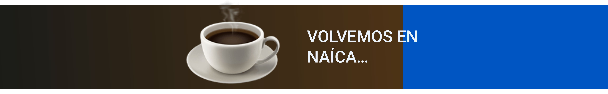

# Streaming progress bar

Esto es una barra de progreso con una cuenta atrás personalizable para incluir como fuente en OBS.

Para el diseño de mi temporada 4 de [Maquetando con Chuck!](https://spacenomads.com/maquetando-con-chuck) quiero una cuenta atrás para el inicio del streaming y para las pausas.

El primer impulso fue hacerlo en vídeo, pero hacer la pieza en HTML/CSS/JS me permite personalizar el temporizador usando queryparams, como un señor.

Por defecto hay dos temas y dos cuentas atras, de 5 minutos y de 2 minutos.

El tema se configura con el parámetro **coffee**, y la duración pasándole los segunods al parámetro **duration**.

| Parámetro | Uso         |
|-----------|-------------|
| coffee    | coffee=true |
| duration | duration=30s |

## Ejemplos

- https://spacenomads.github.io/Streaming-progresss-bar/?coffee=true&duration=30s
- https://spacenomads.github.io/Streaming-progresss-bar/?duration=180s

:)
